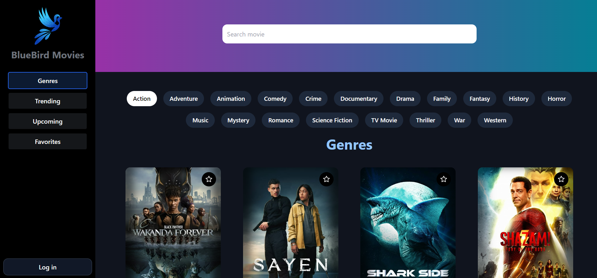

# BlueBird-Movies
BlueBird-Movies is a React-based movie website that allows users to search for movies by title, sort them by genre, view trending and upcoming movies, and bookmark their favorite movies. The website is designed to be user-friendly and visually appealing.

# Features 

- Search movies: users can search for movies by title
- Genre-wise display: movies can be sorted by genre
- Trending Movies: displays a section for trending movies
- Upcoming movies: displays a section for upcoming movies
- Movie Details: users can view detailed information about each movie
- Bookmark Movies: users can bookmark their favorite movies for later viewing
- Google Authentication: users can sign in using their Google account

# Technology

BlueBird-Movies is built using the following technologies:

- ReactJS
- TMDB API
- Firebase Google Authentication
- Framer Motion

# Demo 

- Check out our live demo at https://bluebirdmovies.netlify.app/ 
 
- Youtube video : https://www.youtube.com/watch?v=mGqOOtEGmJc.
